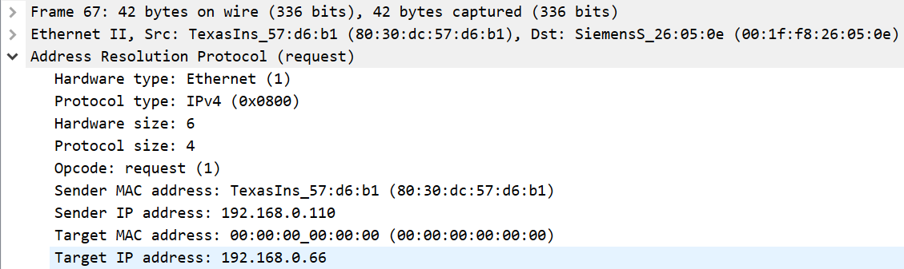

# *1032 Issue Update*

## Scenario #1: SMP and MDL PLC(*Urease Solution Station*) ##

> Conclusion: there's ***NO*** network ping issue during the *`1032`* communication issue period.

### Detailed testing steps and captured information.

1. Login to the SMP device using `CMD prompt`.

   ```shell	
   ssh root@10.135.42.110
   ```

   

2. Get the SMP network device information.

   ```python
   root@beaglebone:~# ifconfig
   eth0      Link encap:Ethernet  HWaddr 80:30:DC:57:D6:B1
             inet addr:192.168.0.110  Bcast:192.168.255.255  Mask:255.255.255.0
             UP BROADCAST RUNNING MULTICAST  MTU:1500  Metric:1
             RX packets:195064 errors:0 dropped:0 overruns:0 frame:0
             TX packets:121633 errors:0 dropped:0 overruns:0 carrier:0
             collisions:0 txqueuelen:1000
             RX bytes:12710070 (12.1 MiB)  TX bytes:12572492 (11.9 MiB)
             Interrupt:171
   ```

3. Within the `CMD prompt`, start the `ping` transactions with the following command.

   ```shell
   Internal ip ping scenario:
   	ping 192.168.0.66
   ```
   
4. Start the `ping` transaction.

   

5. Keep the `ping ` transaction alive.

6. Use the `tcpdump` command to capture all the network packets between **SMP** and **MDL PLC**

   Monitored on the **MDL PLC** equipment, the ***1032*** happened at some points during the ping transaction.

   ```shell
   tcpdump -v host 192.168.0.110 and 192.168.0.66 -s 65535 -w 1032_1.log
   ```

   Captured ***1560*** packets in total.

   

7. Analysis the captured network package files using `Wireshark`.

   There are two types of network packages get captured. `ICMP`(Internet control message protocol) and ***`ARP`***(address resolution protocol).

   a. `ICMP` details

   
   
   
   
   b. `ARP` details
   
   
   
   

## Scenario #2: My Laptop and MDL PLC(*Urease Solution Station*)

> Background: connecting my own laptop to the intranet of the OLC and performing the same testing steps as *`scenario #1`*.
>
> Conclusion: The same result as the testing *`scenario #1`*.

## Scenario #3: MDL PLC HMI(*Urease Solution Station*) to OLC

> Waiting for the *`1032`* communication issue to happen and then verify the result in the captured log file.

1. Operate the MDL PLC HMI with the connected keyboard.

2. Run the `CMD Prompt` from the keyboard by *`win + R`* and  type *`CMD`* from the prompt.

3. Keep pinging the OLC by the following command.

   ```shell
   # change the working directory to My Documents location.
   $: cd My Documents
   
   # store the ping results into the 1032_1.log file.
   $: ping -t 192.168.0.1 > 1032_1.log
   ```

4. Waiting for the *`1032`* communication issue.

   This has not yet occurred during the testing time, and I've kept the ping process alive to expecting for at least one to come out.

5. Check the dumped *`1032_1.log`* file to see whether there's any network broken issue in between.