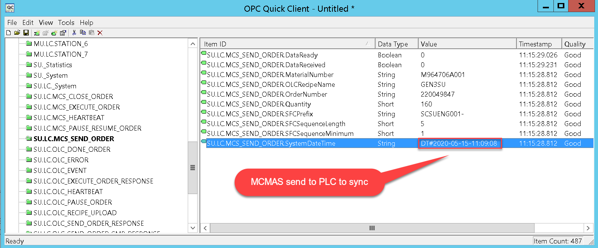

# OLC ISSUE TRACKING AND OFI

> The following highlights the must solving issues before DVT builds.
>
> It also covers the items with relative lower priorities. 
>
> The list is never meant to be complete, it will keep tracking all the important issue items.

## Priority 1(must resolve before end of Jun)

#### OLC production data get overwrote before the data report to ME.

- The SFC from `77` to `89` were missed during the production builds.
- The issue happens only once at SU line.
- OLC reuse the first slots at SFC `90`, the situation at MU line is at SFC `66` instead.


#### OLC integration issue, SFC production data is not reporting to ME.

- OLC data transferring stopped for several times, and get resolved by set `43 ->107`.
- The issue happens at both SU and MU lines.

```python
SCSUENG001-00059, station 2, status: 43(published but not transferred). 	
SCSUENG001-00044, station 6, status: 43(published but not transferred).    
SCSUENG001-00076, station 4, status: 43(published but not transferred).    
SCSUENG001-00132, station 4, status: 43(published but not transferred).
```

  

#### Data could not be reported back to SAP ME for the last unit.

- The production order get closed automatically.
- It happens all the time at both MU and SU lines.
- When manually set the `DataReady` to `1` to start the transferring manually, PLC is not going to make it back to `0`. (seems that the transaction was treated as closed)

#### MU line, Scrap by module is not showing WIP data.  

*   Verified at the SU line, the function works as expected.
*   Both scrapping by RFID and by module function not work correctly at the MU line.

#### Scrapping by RFID, it shows the previous SFC information.

- The issue happens if there's no internal SFC, RFID mapping.
- Following up action.
  - Sebastian to  tweak the current scrapping functionality to take this scenario into consideration.

#### Line status synchronizing issue. 

> PAUSE and RESUME order not synchronized, which requires manual database table change.
>
> - Press the `PAUSE` order command from the SGUI, the OLC get `paused`, but on SGUI, it does not change to `PAUSED` accordingly.
>   - The OLC should report the paused status through interface `OLC_PAUSE_ORDER`.(0-pause, 1..x - pause order due to error)
> - Press the `RESUME` order command from the SGUI, the OLC get `resumed`, but on SGUI, it does not change to `READY` accordingly.

##### The state calculation model:


- Root cause update

  - MCMAS is awaiting for the response from OLC through the interface of `MCMAS_PAUSE_RESUME_ORDER`

  - The agent is triggered at the condition of `DataReceived` == 1, which means this should be set by OLC.

    

  - There's a global setting at OLC HMI OPC tab which determines whether OLC or the MCMAS is going to take control of the `DataReceived` tag.

  - The interface will handle both the `PAUSE` and `RESUME` scenarios.

  - We do have the interface `OLC_PAUSE_ORDER` to update the corresponding status, while it is used at the scenario of initiating by OLC.

- Suggested Solution - to be aligned with Sebastian.

  - The `DataReceived` tag should be treated separately for the following interface.

    

  - OLC should make sure it completed the task before sending out the response.

#### Change the running recipe, hang at `Please Wait`.

- The issue happens at both lines.
- The first time when the issue get trapped was the code change to the `scrapping by RFID/Module` function.
- The root cause of this issue is still not clear, which requires Sebastian to verify.

#### 1032 line control communication fault issue.


- PB has provided the details to Sebastian for trouble shooting. 
- This cause multiple scrapping from the production line.

#### Time synchronization issue

> PLC is not taking the time sent by MCMAS to synchronize itself. 
>
> This happens only once among the previous two months builds.

- MCMAS send the local timestamp to PLC for synchronization.

  

- PLC is not reporting the data using the correct time zone.

  

#### Change verification logic to support the UDI solution.

*   phase 1: change the existing implementation to bypass the comparison.
*   phase 2: following the functional spec to implement the new functionality. 

## Priority 2

#### Report the dosing parameter values in floating format.

*   Following the functional spec to implement the new functionality.
*   The existing calculation logic will not get changed, it will only change the value type.

#### Label inverted working around solution.

> The ZPL command will be overwritten once the line get restarted.

- Check with Sebastian to update the golden ZPL file with the MMDC one.

#### A new window at HR station HMI to show the SMP replied message.
